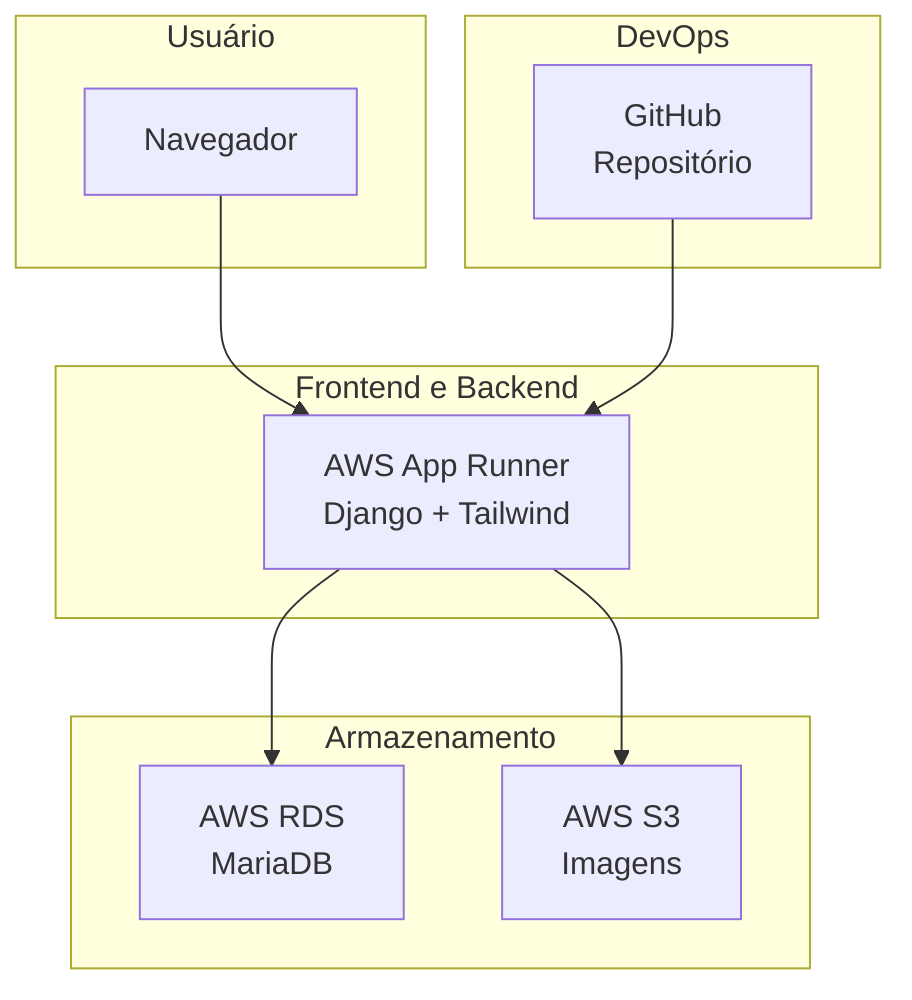

# FeijoadaWeek.com.br

Todo dia é dia de feijoada!

Este é um projeto pessoal que celebra a paixão brasileira por feijoadas. Aqui você encontra avaliações, fotos, dicas e informações sobre os melhores lugares para comer feijoada no Brasil, começando por São Paulo.

Este readme.md foi escrito e revisado com ajuda de IA.

## Versões utilizadas

- Python: 3.8.13
- Django: 3.2.20
- MariaDB: 11.4.5
- mysqlclient: 2.2.0

## Arquitetura e Serviços Utilizados

O projeto utiliza uma arquitetura simples e escalável baseada em serviços da AWS:

### Infraestrutura

## Diagrama de Arquitetura



- **AWS App Runner**
  - Serviço utilizado para hospedar a aplicação Django.
  - Implantação automática vinculada ao repositório GitHub (CI simplificado).
  - Atualmente configurado com a menor capacidade disponível:  
    `0.25 vCPU` & `0.5 GB` de memória.
  - Em breve, adicionarei os custos mensais aproximados dessa configuração.

- **AWS RDS (MariaDB)**
  - Banco de dados relacional utilizado para armazenar os dados da aplicação (posts, slugs, etc.).
  - Gerenciado, com backups automáticos e acesso restrito por VPC.

- **AWS S3**
  - Armazenamento de imagens dos posts e headers do site.
  - URLs públicas utilizadas diretamente nos templates.

### Integração com GitHub

- O repositório está vinculado ao App Runner.
- A cada push na branch principal, a aplicação é automaticamente reconstruída e publicada.
- Isso simplifica bastante o fluxo de entrega contínua (CI/CD).


# ROADMAP

## Funcionalidades

- Página individual para cada restaurante
  - Fotos, descrição, localização e nota
  - Tags como `gourmet`, `rodízio`, `vegana`, etc.
- Filtros e busca por:
  - Bairro
  - Preço
  - Tipo de feijoada
  - Dia da semana
- Calendário de feijoadas
- Modo escuro (Dark Mode)
- Responsivo e otimizado para mobile

## Conteúdo e Engajamento

- Avaliações reais e imparciais
- Favoritos para salvar seus restaurantes preferidos
- Newsletter semanal com destaque das melhores feijoadas
- Comentários e notas de usuários

## Estilo e Design

- Tipografia personalizada com Tailwind CSS
- Imagens de alta qualidade com preload inteligente
- Ilustrações e mascotes temáticos (em breve)
- Animações leves com Framer Motion (planejado)

## Futuras Extensões

- Parcerias com restaurantes
- Vitrine de promoções exclusivas
- Loja de produtos personalizados (camisetas, aventais, canecas)
- Marketplace de delivery com integração a iFood ou WhatsApp
- Sistema de recompensas para usuários ativos

## SEO e Performance

- PWA (Progressive Web App) para uso offline e instalação no celular
- SEO técnico otimizado (Open Graph, meta tags, sitemap.xml)

## Integrações

- Compartilhamento fácil para WhatsApp, Instagram e Twitter
- Feed com publicações de redes sociais (Instagram Reels, TikTok)
- Geolocalização para mostrar feijoadas “perto de você”

## Tecnologias

- Backend: Django + PostgreSQL
- Frontend: HTML + Tailwind CSS
- Imagens hospedadas em AWS S3
- Implantação em ambiente Linux

## Objetivo

O projeto visa unir gastronomia, cultura e tecnologia de forma leve e divertida, com potencial para crescer como uma referência nacional em avaliações de feijoadas.

---

> Todo dia é dia de feijoada. Seja bem-vindo à Feijoada Week.
```
# source venv/bin/activate
# python manage.py runserver
# python manage.py tailwind build
# python manage.py tailwind start
```